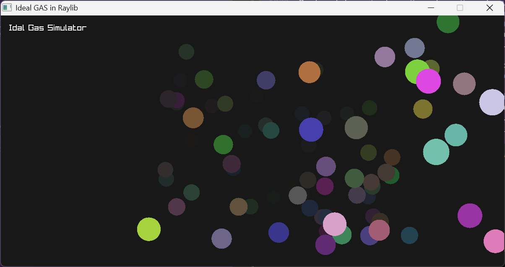

# Ideal Gas Simulator

Simple simulator that using raylib to render.

[raylib](https://github.com/raysan5/raylib/)

## Build

Using [nob.h](https://github.com/tsoding/nob.h)(recommend checking this amazing project) at Windows 11.
It should be way easier on linux I supposed.

Windows environment: [w64devkit](https://github.com/skeeto/w64devkit/)
> I try msvc, but it just segfault and link fail again and again...
> The compile tag and this environment follow [raylib Windows instrucment](https://github.com/raysan5/raylib/wiki/Working-on-Windows)
> 

```bash
# start up,
# gcc should in the $Path, it sould work at Windows 11
# by add /path/to/w64devkit/bin to Path
# check the raylib include path in nob.c
# 
gcc -o nob.exe nob.c

# compile and run
./nob.exe -r
```



